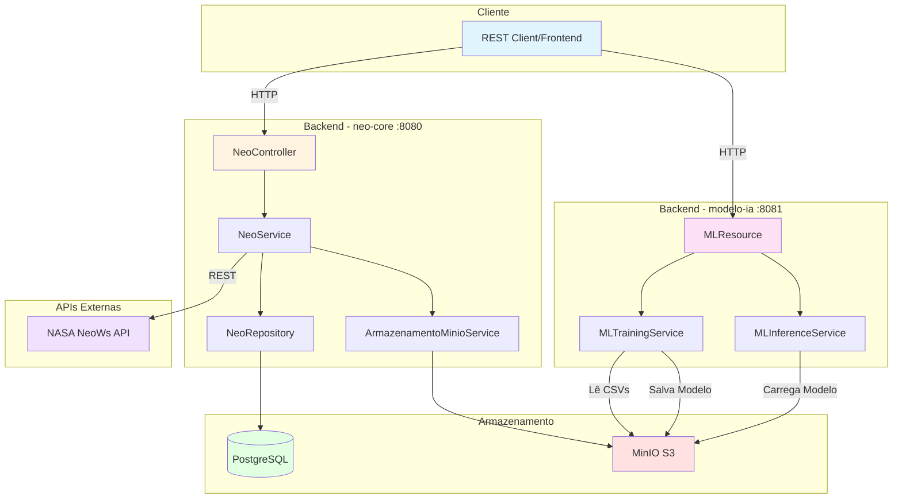
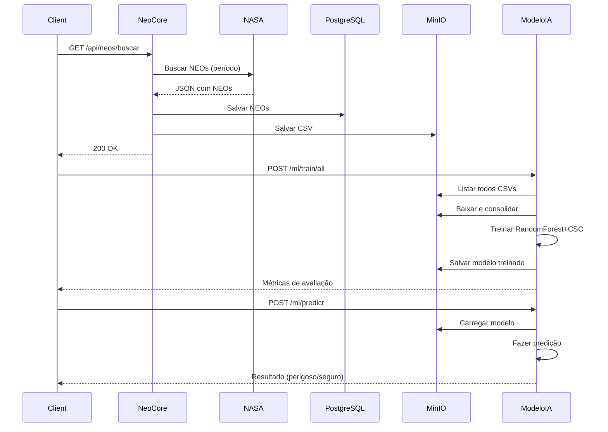

# 🌌 Sistema de Predição de NEOs Potencialmente Perigosos

<div align="center">


**Sistema inteligente de coleta, armazenamento e predição de NEOs (Near Earth Objects) usando Machine Learning**

[Documentação](#-documentação) • [Arquitetura](#-arquitetura) • [Como Usar](#-como-usar) • [Machine Learning](#-machine-learning) • [API](#-api)

</div>

---

## 📋 Índice

- [Sobre o Projeto](#-sobre-o-projeto)
- [Arquitetura](#-arquitetura)
- [Tecnologias](#-tecnologias)
- [Pré-requisitos](#-pré-requisitos)
- [Instalação](#-instalação)
- [Como Usar](#-como-usar)
- [Machine Learning](#-machine-learning)
- [API Endpoints](#-api-endpoints)
- [Métricas e Resultados](#-métricas-e-resultados)
- [Roadmap](#-roadmap)

---

## 🎯 Sobre o Projeto

Este projeto implementa um **sistema completo de análise e predição** de **NEOs (Near-Earth Objects)** - asteroides e cometas que passam próximos à Terra. O sistema:

- 🛰️ **Coleta dados em tempo real** da NASA NeoWs API
- 💾 **Armazena** informações em PostgreSQL e CSVs no MinIO
- 🤖 **Treina modelos de Machine Learning** para prever perigosidade
- 🎯 **Classifica NEOs** como potencialmente perigosos ou seguros
- 📊 **Fornece APIs REST** para integração e consulta

### 🎓 Contexto Acadêmico

Projeto desenvolvido para a **FIAP** como parte do curso de Engenharia de Machine Learning, demonstrando:
- Arquitetura de microsserviços com Quarkus
- Integração com APIs externas (NASA)
- Persistência e Data Lake (PostgreSQL + MinIO)
- Machine Learning aplicado (Weka + Random Forest)
- Cost-Sensitive Learning para problemas desbalanceados

---

## 🏗️ Arquitetura

### Diagrama de Alto Nível



### Estrutura de Módulos

```
neo-parent/
│
├── 📦 neo-core (porta 8080)          # Coleta e Armazenamento
│   ├── 🎮 Controllers                 # REST endpoints
│   ├── 💼 Services                    # Lógica de negócio
│   ├── 🗄️ Repositories                # Acesso a dados
│   ├── 🔧 Config                      # Configurações
│   └── 📊 Domain                      # Modelos e DTOs
│
├── 🤖 modelo-ia (porta 8081)         # Machine Learning
│   ├── 🎯 MLResource                  # ML endpoints
│   ├── 🧠 MLTrainingService           # Treinamento
│   ├── 🔮 MLInferenceService          # Predições
│   └── ⚙️ Config                      # S3Client, etc
│
└── 🐳 docker-compose.yml             # PostgreSQL + MinIO
```

### Fluxo de Dados



---

## 🛠️ Tecnologias

### Backend
| Tecnologia | Versão | Descrição |
|-----------|--------|-----------|
|  | 17 | Linguagem de programação |
|  | 3.28.1 | Framework supersônico |
|  | 3.9+ | Gerenciador de dependências |
|  | 6.x | ORM / JPA |
|  | 1.6.3 | Object mapping |

### Machine Learning
| Tecnologia | Versão | Descrição |
|-----------|--------|-----------|
|  | 3.8.6 | Framework de ML |
| **Random Forest** | - | Algoritmo de classificação |
| **CostSensitiveClassifier** | - | Meta-classificador |
| **Evaluation Metrics** | - | Precision, Recall, F1, AUC |

### Banco de Dados & Storage
| Tecnologia | Versão | Descrição |
|-----------|--------|-----------|
|  | 16 | Banco relacional |
|  | latest | Object storage (S3) |
|  | latest | Database migrations |

### APIs Externas
| API | Descrição |
|-----|-----------|
|  | Near Earth Object Web Service |

---

## 📋 Pré-requisitos

Antes de começar, você precisa ter instalado:

- ☕ **Java 17+** - [Download](https://adoptium.net/)
- 🔧 **Maven 3.9+** - [Download](https://maven.apache.org/download.cgi)
- 🐳 **Docker & Docker Compose** - [Download](https://www.docker.com/products/docker-desktop)
- 🔑 **NASA API Key** - [Obter chave](https://api.nasa.gov/)

### Verificar Instalação

```bash
# Java
java -version
# Output esperado: openjdk version "17.x.x"

# Maven
mvn -version
# Output esperado: Apache Maven 3.9.x

# Docker
docker --version
docker-compose --version
```

---

## 🚀 Instalação

### 1. Clonar o Repositório

```bash
git clone <url-do-repositorio>
cd neo
```

### 2. Configurar NASA API Key

Edite `neo-core/src/main/resources/application.properties`:

```properties
# NASA NeoWs API
nasa.api.key=SUA_CHAVE_AQUI
nasa.api.base-url=https://api.nasa.gov/neo/rest/v1
```

### 3. Iniciar Infraestrutura (PostgreSQL + MinIO)

```bash
cd neo-core
docker-compose up -d

# Verificar se está rodando
docker ps
```

**URLs de Acesso:**
- 🗄️ **PostgreSQL**: `localhost:5432` (neo/neo)
- 📦 **MinIO Console**: http://localhost:9001 (minioadmin/minioadmin)
- 📦 **MinIO API**: http://localhost:9000

### 4. Compilar o Projeto

```bash
# Voltar para raiz
cd ..

# Compilar todos os módulos
mvn clean install
```

---

## 💻 Como Usar

### Iniciar os Serviços

Abra **2 terminais** separados:

**Terminal 1 - neo-core (Backend Principal)**
```bash
cd neo-core
./mvnw quarkus:dev

# No Windows:
mvnw.cmd quarkus:dev
```

**Terminal 2 - modelo-ia (Machine Learning)**
```bash
cd modelo-ia
../mvnw quarkus:dev

# No Windows:
..\mvnw.cmd quarkus:dev
```

### Acessar as Aplicações

- 🌐 **neo-core API**: http://localhost:8080
- 🤖 **modelo-ia API**: http://localhost:8081
- 📖 **Swagger neo-core**: http://localhost:8080/q/swagger-ui
- 📖 **Swagger modelo-ia**: http://localhost:8081/q/swagger-ui

---

## 🤖 Machine Learning

### Pipeline de ML

```mermaid
graph LR
    A[1. Coleta de Dados<br/>NASA API] --> B[2. Armazenamento<br/>PostgreSQL + MinIO CSV]
    B --> C[3. Consolidação<br/>24 CSVs → 3038 instâncias]
    C --> D[4. Pré-processamento<br/>Split 80/20]
    D --> E[5. Treinamento<br/>RandomForest + CSC]
    E --> F[6. Avaliação<br/>Métricas]
    F --> G[7. Persistência<br/>Modelo .model]
    G --> H[8. Inferência<br/>Predições]
    
    style A fill:#e1f5ff
    style E fill:#ffe1f5
    style F fill:#e1ffe1
    style H fill:#fff4e1
```



### Features Utilizadas

| Feature | Tipo | Descrição | Exemplo |
|---------|------|-----------|---------|
| `magnitudeAbsoluta` | Numérica | Brilho absoluto do asteroide | 19.5 |
| `diametroMinM` | Numérica | Diâmetro mínimo estimado (metros) | 450.0 |
| `diametroMaxM` | Numérica | Diâmetro máximo estimado (metros) | 1000.0 |
| `velocidadeKmS` | Numérica | Velocidade relativa à Terra (km/s) | 25.3 |
| **Target** | Categórica | `ehPotencialmentePerigoso` | true/false |

### Algoritmo: Random Forest + Cost-Sensitive Classifier

#### Por que Cost-Sensitive?

Em problemas de detecção de NEOs perigosos, os custos dos erros são **assimétricos**:

- ❌ **Falso Negativo (FN)**: NEO perigoso classificado como seguro → **MUITO RUIM** 💀
- ⚠️ **Falso Positivo (FP)**: NEO seguro classificado como perigoso → ruim, mas aceitável 🔍

**Matriz de Custos:**

|  | Predito: Seguro | Predito: Perigoso |
|--|----------------|-------------------|
| **Real: Seguro** | ✅ 0 | ⚠️ 1 |
| **Real: Perigoso** | ❌ **10** | ✅ 0 |

```java
// Configuração do CostSensitiveClassifier
CostMatrix cm = new CostMatrix(2);
cm.setElement(idxTrue, idxFalse, 10.0);  // FN = custo 10
cm.setElement(idxFalse, idxTrue, 1.0);   // FP = custo 1

CostSensitiveClassifier csc = new CostSensitiveClassifier();
csc.setClassifier(new RandomForest());
csc.setMinimizeExpectedCost(true);
csc.setCostMatrix(cm);
```

### Treinar o Modelo

```bash
# POST para treinar com todos os CSVs do bucket
curl -X POST http://localhost:8081/ml/train/all

# Ou com período específico
curl -X POST http://localhost:8081/ml/train \
  -H "Content-Type: application/json" \
  -d '{
    "inicio": "2023-01-01",
    "fim": "2023-12-31"
  }'
```

**Saída do Treinamento:**

```
🔄 Listando todos os CSVs no bucket: neo-raw
📊 Encontrados 24 CSVs no bucket
📥 Lendo: raw/2025-02-01/neows-feed-xxx.csv
✅ CSV processado: 112 instâncias adicionadas (total: 3038)
...
📈 Dataset final: 3038 instâncias de 24 CSVs processados
🎯 Train=2430, Test=608

=== Avaliação Holdout (20%) / CostSensitive ===
Correctly Classified Instances          544       89.4737 %
Incorrectly Classified Instances         64       10.5263 %
Kappa statistic                           0.7872
Mean absolute error                       0.1413
Root mean squared error                   0.2893
Total Number of Instances               608

=== Detailed Accuracy By Class ===

                 TP Rate  FP Rate  Precision  Recall   F-Measure  ROC Area  Class
                 0.833    0.062    0.909      0.833    0.869      0.953     false
                 0.938    0.167    0.880      0.938    0.908      0.953     true
Weighted Avg.    0.895    0.124    0.893      0.895    0.892      0.953

=== Confusion Matrix ===

   a   b   <-- classified as
  85  17 |   a = false
  32 474 |   b = true

AUC (classe positiva='true'): 0.9530

💾 Modelo salvo: models/weka-rf-csc-1728095432.model
```

---

## 📊 Métricas e Resultados

### Comparação: Sem vs Com Cost-Sensitive

| Métrica | Sem CSC | Com CSC | Melhoria |
|---------|---------|---------|----------|
| **Acurácia Geral** | 87.8% | 89.5% | +1.7% |
| **Recall (true)** | 85.2% | **93.8%** | **+8.6%** ✨ |
| **Precision (true)** | 90.1% | 88.0% | -2.1% |
| **F1-Score (true)** | 87.6% | 90.8% | +3.2% |
| **AUC** | 0.938 | **0.953** | +1.5% |
| **Falsos Negativos** | 75 | **32** | **-57%** 🎯 |

### Visualização da Matriz de Confusão

```
              PREDITO
              Seguro  Perigoso
REAL  Seguro    85      17      ← FP (alarme falso)
      Perigoso  32      474     ← FN (perdeu perigoso) ❌
                ↑
                FN: Reduzido de 75 → 32 com CSC!
```

### Interpretação

- ✅ **Recall alto (93.8%)**: O modelo identifica **93.8% dos NEOs perigosos**
- ✅ **Falsos Negativos reduzidos**: De 75 para 32 (57% de melhoria)
- ✅ **AUC de 0.953**: Excelente capacidade de discriminação
- ⚠️ **Trade-off aceitável**: Pequena perda em precisão para ganhar muito mais recall

---

## 🔌 API Endpoints

### neo-core (porta 8080)

#### 🔍 Buscar NEOs da NASA

```http
GET /api/neos/buscar?inicio=2025-01-01&fim=2025-01-07
```

**Resposta:**
```json
{
  "totalProcessados": 147,
  "salvosNoBanco": 147,
  "csvGerado": "raw/2025-01-07/neows-feed-1728095432.csv",
  "bucketMinIO": "neo-raw"
}
```

#### 📋 Listar NEOs

```http
GET /api/neos?page=0&size=20
```

#### ⚠️ Listar NEOs Perigosos

```http
GET /api/neos/perigosos
```

### modelo-ia (porta 8081)

#### 🧠 Treinar Modelo (com todos os dados)

```http
POST /ml/train/all
```

**Resposta:**
```json
{
  "evaluation": "\n=== Avaliação Holdout (20%) / CostSensitive ===\nCorrectly Classified: 89.47%\n...",
  "modelKey": "models/weka-rf-csc-1728095432.model"
}
```

#### 🧠 Treinar Modelo (período específico)

```http
POST /ml/train
Content-Type: application/json

{
  "inicio": "2023-01-01",
  "fim": "2023-12-31"
}
```

#### 🔮 Fazer Predição

```http
POST /ml/predict
Content-Type: application/json

{
  "magnitudeAbsoluta": 19.5,
  "diametroMinM": 450.0,
  "diametroMaxM": 1000.0,
  "velocidadeKmS": 25.3
}
```

**Resposta:**
```json
{
  "predicted": "true",
  "probTrue": 0.87,
  "probFalse": 0.13
}
```

#### 🔄 Recarregar Modelo

```http
POST /ml/reload
```

---

## 📦 Exemplos Práticos

### Cenário Completo: Da Coleta à Predição

```bash
# 1️⃣ Coletar dados da NASA (últimos 7 dias)
curl "http://localhost:8080/api/neos/buscar?inicio=2025-01-01&fim=2025-01-07"

# 2️⃣ Treinar modelo com todos os dados coletados
curl -X POST http://localhost:8081/ml/train/all

# 3️⃣ Fazer uma predição
curl -X POST http://localhost:8081/ml/predict \
  -H "Content-Type: application/json" \
  -d '{
    "magnitudeAbsoluta": 19.5,
    "diametroMinM": 450.0,
    "diametroMaxM": 1000.0,
    "velocidadeKmS": 25.3
  }'

# Resultado: {"predicted": "true", "probTrue": 0.87, "probFalse": 0.13}
```

### Acessar MinIO Console

1. Abra http://localhost:9001
2. Login: `minioadmin` / `minioadmin`
3. Navegue até bucket `neo-raw`
4. Veja os CSVs em `raw/YYYY-MM-DD/`
5. Veja os modelos em `models/`

---

## 📈 Distribuição dos Dados

### Estatísticas do Dataset (3038 instâncias)

| Estatística | Valor |
|-------------|-------|
| **Total de NEOs** | 3.038 |
| **NEOs Seguros (false)** | 532 (17.5%) |
| **NEOs Perigosos (true)** | 2.506 (82.5%) |
| **Período de coleta** | 2020-2025 |
| **Total de CSVs** | 24 |

### Desbalanceamento de Classes

```
■■■■■■■■■■■■■■■■■■■■■■■■■■■■■■■■■■■■■■■■ 82.5% Perigosos (true)
■■■■■■■■ 17.5% Seguros (false)
```

> 🔔 **Nota**: O dataset é **desbalanceado**, favorecendo a classe "perigoso". 
> Por isso, métricas como **Recall** e **F1-Score** são mais importantes que acurácia simples.

---

## 🛣️ Roadmap

### ✅ Implementado

- [x] Integração com NASA NeoWs API
- [x] Persistência em PostgreSQL
- [x] Data Lake com MinIO (S3)
- [x] Export para CSV
- [x] Treinamento de modelo ML (Random Forest)
- [x] Cost-Sensitive Learning
- [x] API de predição
- [x] Avaliação com métricas completas (Precision, Recall, F1, AUC)
- [x] Arquitetura multi-módulo (neo-core + modelo-ia)

### 🚧 Em Desenvolvimento

- [ ] Dashboard de visualização (frontend React/Vue)
- [ ] Retreinamento automático periódico
- [ ] Threshold tuning automático
- [ ] SMOTE para balanceamento de classes
- [ ] Validação cruzada (K-fold)

### 💡 Futuro

- [ ] Deploy em nuvem (Azure/AWS)
- [ ] Alertas em tempo real via email/SMS
- [ ] Mais features (órbita, composição, histórico)
- [ ] Ensemble de modelos (XGBoost, LightGBM)
- [ ] API de notificação para órgãos espaciais
- [ ] Integração com Telegram/Discord bot

---

## 🎓 Aprendizados e Decisões Técnicas

### Por que Quarkus?

- ⚡ **Supersônico**: Startup em <1 segundo
- 🔥 **Live Reload**: Mudanças refletem instantaneamente
- 📦 **Native**: Compilação nativa com GraalVM (opcional)
- 🎯 **Developer Joy**: Developer experience excepcional

### Por que PostgreSQL + MinIO?

- 🗄️ **PostgreSQL**: Dados estruturados (NEOs, metadados)
- 📦 **MinIO**: Dados semi-estruturados (CSVs, modelos ML)
- 🔄 **Separação de responsabilidades**: OLTP vs Data Lake
- 💰 **Custo**: MinIO é open-source e compatível com S3

### Por que Weka?

- 🎓 **Acadêmico**: Amplamente usado em universidades
- 📚 **Completo**: Muitos algoritmos prontos
- 🔧 **Fácil**: API simples e bem documentada
- 🎯 **CostMatrix**: Suporte nativo a cost-sensitive learning

---

## 🐛 Troubleshooting

### Erro: "Port 8080 already in use"

```bash
# Windows
netstat -ano | findstr :8080
taskkill /PID <PID> /F

# Linux/Mac
lsof -ti:8080 | xargs kill -9
```

### Erro: "Could not connect to PostgreSQL"

```bash
# Verificar se o container está rodando
docker ps

# Reiniciar containers
cd neo-core
docker-compose down
docker-compose up -d
```

### Erro: "NASA API Rate Limit"

A API da NASA tem limite de 1000 requisições/hora. Se exceder:
- Aguarde 1 hora
- Ou obtenha uma API key premium

---

## 🤝 Contribuindo

Contribuições são bem-vindas! Para contribuir:

1. Fork o projeto
2. Crie uma branch (`git checkout -b feature/MinhaFeature`)
3. Commit suas mudanças (`git commit -m 'feat: Minha nova feature'`)
4. Push para a branch (`git push origin feature/MinhaFeature`)
5. Abra um Pull Request

### Padrão de Commits

Seguimos o [Conventional Commits](https://www.conventionalcommits.org/):

- `feat:` Nova funcionalidade
- `fix:` Correção de bug
- `docs:` Documentação
- `style:` Formatação de código
- `refactor:` Refatoração
- `test:` Testes
- `chore:` Tarefas gerais

---

## 📝 Licença

Este projeto foi desenvolvido para fins acadêmicos na **FIAP**.

---

## 👥 Autores

Projeto desenvolvido por alunos de Engenharia de Machine Learning - FIAP

---

## 📚 Referências

- [NASA NeoWs API](https://api.nasa.gov/)
- [Quarkus Documentation](https://quarkus.io/guides/)
- [Weka Documentation](https://waikato.github.io/weka-wiki/)
- [MinIO Documentation](https://min.io/docs/minio/linux/index.html)
- [Cost-Sensitive Learning](https://machinelearningmastery.com/cost-sensitive-learning-for-imbalanced-classification/)
- [Random Forest Algorithm](https://www.stat.berkeley.edu/~breiman/RandomForests/cc_home.htm)

---

## 🙏 Agradecimentos

- **NASA** - Por disponibilizar a API NeoWs gratuitamente
- **FIAP** - Pelo suporte acadêmico
- **Comunidade Open Source** - Pelas ferramentas incríveis

---

<div align="center">

**⭐ Se este projeto foi útil, deixe uma estrela! ⭐**

[](https://github.com)
[](https://linkedin.com)

Made with ☕ and 🧠 by FIAP Students

</div>
